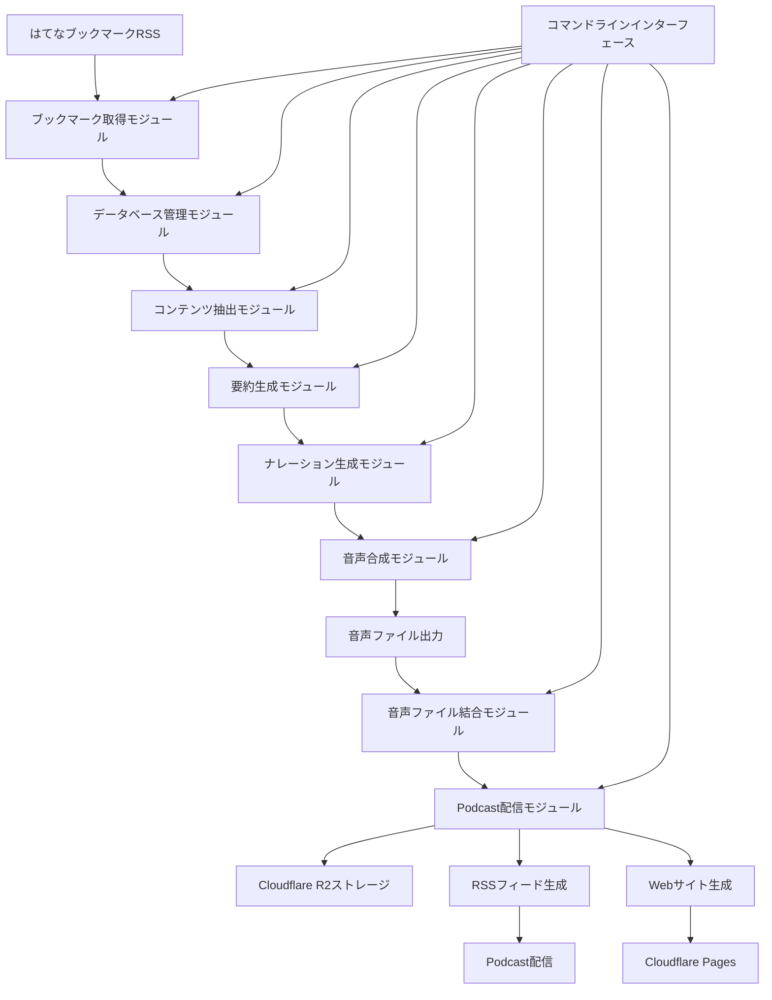

# はてなブックマーク音声化システム DESIGN.md

## 1. システム概要

このシステムは、ユーザーのはてなブックマークから記事やPDFを取得し、内容を要約して1人のナレーターによる解説形式の音声ファイル（MP3）を生成するTypeScriptアプリケーションです。ローカルPCで動作し、SQLiteでデータを管理します。また、生成された音声ファイルをPodcastとして配信する機能も備えています。

## 2. システムアーキテクチャ

システムは以下の主要コンポーネントで構成されます：



### 2.1 各コンポーネントの役割

1. **ブックマーク取得モジュール**
   - はてなブックマークのRSSフィードからブックマーク情報を取得
   - 新規ブックマークの検出と既存データとの比較

2. **データベース管理モジュール**
   - SQLiteを使用したデータの永続化
   - ブックマーク情報、コンテンツ、要約、音声ファイルのメタデータ管理

3. **コンテンツ抽出モジュール**
   - Webページからの記事本文抽出
   - PDFからのテキスト抽出
   - 画像や表などの非テキスト要素の処理

4. **要約生成モジュール**
   - 抽出したコンテンツの要約生成
   - 要約の品質確保と長さ調整

5. **ナレーション生成モジュール**
   - 要約を1人のナレーターによる解説形式に変換
   - 記事紹介、解説、コメントの構造化

6. **音声合成モジュール**
   - テキストから音声への変換
   - 音声品質の最適化

7. **音声ファイル結合モジュール**
   - 複数の音声ファイルを一つのMP3ファイルに結合（音声ファイル間に2.5秒の無音を挿入）
   - プレイリストの音声ファイルを結合
   - 指定した音声ファイルIDを結合
   - 未処理の音声ファイル（まだマージされていない音声ファイル）を自動でマージ
   - process-allコマンドの最後に自動的にファイル結合処理を実行
   - ラジオ風の挨拶と結びを追加（process-allコマンド実行時）
     - 開始時の挨拶音声ファイル（radio_intro.mp3）を自動生成
     - 終了時の結び音声ファイル（radio_outro.mp3）を自動生成
     - 結合時に挨拶→本編→結びの順で音声ファイルを結合

8. **Podcast配信モジュール**
   - 音声ファイルをCloudflare R2にアップロード
   - エピソードのメタデータを自動生成
   - RSSフィードの生成
   - Webサイトの生成とデプロイ
   - エピソードの公開管理

9. **コマンドラインインターフェース**
   - ユーザーコマンドの処理
   - 処理状況の表示
   - エラーハンドリング

## 3. データフロー

1. はてなブックマークRSSから最新のブックマーク情報を取得
2. 取得したブックマーク情報をデータベースと比較し、新規ブックマークを特定
3. 新規ブックマークのURLからコンテンツを抽出
4. 抽出したコンテンツを要約
5. 要約を1人のナレーターによる解説形式に変換
6. 解説テキストを音声に変換
7. 音声ファイルをMP3形式で保存
8. 処理結果をデータベースに記録
9. 挨拶と結びの音声ファイルを生成（初回のみ）
10. 未処理の音声ファイルを挨拶→本編→結びの順で結合
11. 結合された音声ファイルをCloudflare R2にアップロード
12. エピソードのメタデータを自動生成
13. RSSフィードを更新
14. Webサイトを生成してCloudflare Pagesにデプロイ

## 4. データベーススキーマ

SQLiteデータベースには以下のテーブルを作成します：

```sql
-- ブックマーク情報テーブル
CREATE TABLE bookmarks (
    id INTEGER PRIMARY KEY AUTOINCREMENT,
    url TEXT NOT NULL UNIQUE,
    title TEXT NOT NULL,
    description TEXT,
    bookmark_date DATETIME NOT NULL,
    tags TEXT,
    content_type TEXT,  -- 'article', 'pdf', etc.
    processed BOOLEAN DEFAULT FALSE,
    created_at DATETIME DEFAULT CURRENT_TIMESTAMP
);

-- コンテンツテーブル
CREATE TABLE contents (
    id INTEGER PRIMARY KEY AUTOINCREMENT,
    bookmark_id INTEGER NOT NULL,
    raw_content TEXT,
    extracted_at DATETIME DEFAULT CURRENT_TIMESTAMP,
    FOREIGN KEY (bookmark_id) REFERENCES bookmarks(id)
);

-- ナレーションテーブル
CREATE TABLE narrations (
    id INTEGER PRIMARY KEY AUTOINCREMENT,
    bookmark_id INTEGER NOT NULL,
    narration_text TEXT NOT NULL,
    generated_at DATETIME DEFAULT CURRENT_TIMESTAMP,
    FOREIGN KEY (bookmark_id) REFERENCES bookmarks(id)
);

-- 音声ファイルテーブル
CREATE TABLE audio_files (
    id INTEGER PRIMARY KEY AUTOINCREMENT,
    bookmark_id INTEGER NOT NULL,
    file_path TEXT NOT NULL,
    duration INTEGER,  -- 秒単位
    generated_at DATETIME DEFAULT CURRENT_TIMESTAMP,
    FOREIGN KEY (bookmark_id) REFERENCES bookmarks(id)
);

-- プレイリストテーブル
CREATE TABLE playlists (
    id INTEGER PRIMARY KEY AUTOINCREMENT,
    name TEXT NOT NULL,
    created_at DATETIME DEFAULT CURRENT_TIMESTAMP
);

-- プレイリスト項目テーブル
CREATE TABLE playlist_items (
    id INTEGER PRIMARY KEY AUTOINCREMENT,
    playlist_id INTEGER NOT NULL,
    audio_file_id INTEGER NOT NULL,
    position INTEGER NOT NULL,
    FOREIGN KEY (playlist_id) REFERENCES playlists(id),
    FOREIGN KEY (audio_file_id) REFERENCES audio_files(id)
);

-- 結合音声ファイルテーブル
CREATE TABLE merged_audio_files (
    id INTEGER PRIMARY KEY AUTOINCREMENT,
    name TEXT NOT NULL,
    file_path TEXT NOT NULL,
    source_files TEXT NOT NULL, -- JSON形式で音声ファイルIDの配列を保存
    duration INTEGER,
    created_at DATETIME DEFAULT CURRENT_TIMESTAMP
);

-- Podcastエピソードテーブル（新規追加）
CREATE TABLE podcast_episodes (
    id INTEGER PRIMARY KEY AUTOINCREMENT,
    merged_audio_file_id INTEGER NOT NULL,
    title TEXT NOT NULL,
    description TEXT,
    source_bookmarks TEXT, -- JSON形式でブックマークIDの配列を保存
    published_at DATETIME DEFAULT CURRENT_TIMESTAMP,
    duration INTEGER,
    file_size INTEGER,
    storage_url TEXT,
    is_published BOOLEAN DEFAULT FALSE,
    FOREIGN KEY (merged_audio_file_id) REFERENCES merged_audio_files(id)
);

-- Podcastシリーズ設定テーブル（新規追加）
CREATE TABLE podcast_settings (
    id INTEGER PRIMARY KEY AUTOINCREMENT,
    title TEXT NOT NULL DEFAULT 'Yuhei Nakasakaのはてなブックマークラジオ',
    description TEXT DEFAULT 'はてなブックマークの記事を要約して音声化したポッドキャスト',
    author TEXT DEFAULT 'Yuhei Nakasaka',
    email TEXT,
    language TEXT DEFAULT 'ja',
    category TEXT DEFAULT 'Technology',
    explicit BOOLEAN DEFAULT FALSE,
    image_url TEXT,
    website_url TEXT,
    feed_url TEXT,
    updated_at DATETIME DEFAULT CURRENT_TIMESTAMP
);
```

## 5. 技術スタックと依存関係

### 5.1 コア技術

- **言語**: TypeScript 5.x
- **ランタイム**: Node.js 18.x以上
- **パッケージマネージャ**: npm/yarn
- **データベース**: SQLite3
- **クラウドストレージ**: Cloudflare R2
- **ホスティング**: Cloudflare Pages

### 5.2 主要ライブラリ

- **プロジェクト構成**
  - `typescript`: TypeScriptコンパイラ
  - `ts-node`: TypeScriptの直接実行
  - `eslint`: コード品質管理
  - `prettier`: コードフォーマット

- **データ取得・処理**
  - `axios`: HTTPリクエスト
  - `rss-parser`: RSSフィード解析
  - `cheerio`: HTMLパース・スクレイピング
  - `pdf-parse`: PDF解析
  - `turndown`: HTMLからMarkdownへの変換（必要に応じて）

- **データベース**
  - `better-sqlite3`: SQLiteインターフェース
  - `knex`: SQLクエリビルダー（オプション）

- **AI・テキスト処理**
  - `openai`: OpenAI API（GPT-4、Whisper）
  - または `@anthropic-ai/sdk`: Claude API

- **音声合成**
  - `openai`: OpenAI TTS API
  - または `@google-cloud/text-to-speech`: Google Cloud TTS
  - または `elevenlabs`: ElevenLabs API（高品質だが有料）

- **音声処理**
  - `fluent-ffmpeg`: FFmpegラッパー（必要に応じて）

- **CLI**
  - `commander`: コマンドライン引数解析
  - `inquirer`: インタラクティブCLI
  - `chalk`: ターミナル出力の色付け
  - `ora`: ローディングスピナー

- **Podcast配信（新規追加）**
  - `@aws-sdk/client-s3`: Cloudflare R2（S3互換API）クライアント
  - `@aws-sdk/lib-storage`: S3アップロード用ユーティリティ
  - `podcast`: RSSフィード生成
  - `next`: Webサイト生成フレームワーク
  - `react`: UIコンポーネント
  - `react-dom`: DOMレンダリング
  - `wrangler`: Cloudflare Pages CLI

### 5.3 音声合成オプション比較

| サービス | 品質 | コスト | 特徴 |
|---------|------|-------|------|
| OpenAI TTS | 高 | 中 | 自然な音声、多言語対応、APIキー必要 |
| Google Cloud TTS | 高 | 中〜低 | 多言語対応、無料枠あり、GCPアカウント必要 |
| ElevenLabs | 非常に高 | 高 | 最高品質、感情表現可能、高コスト |
| Microsoft Azure TTS | 高 | 中〜低 | 多言語対応、無料枠あり、Azureアカウント必要 |
| Amazon Polly | 中〜高 | 低 | コスト効率良好、AWSアカウント必要 |
| Web Speech API | 中 | 無料 | ブラウザ依存、オフライン不可、品質限定的 |

**推奨**: コスト効率と品質のバランスを考慮すると、Google Cloud TTSまたはAmazon Pollyが適しています。初期実装ではGoogle Cloud TTSを使用し、必要に応じて他のサービスに切り替えられるよう抽象化します。

## 6. ディレクトリ構造

```
hatebu-audio/
├── src/
│   ├── index.ts                 # エントリーポイント
│   ├── types/                   # 型定義
│   ├── config/                  # 設定ファイル
│   ├── cli/                     # CLIインターフェース
│   ├── services/                # サービスレイヤー
│   │   ├── bookmark/            # ブックマーク取得
│   │   ├── content/             # コンテンツ抽出
│   │   ├── narration/           # ナレーション生成
│   │   ├── tts/                 # 音声合成
│   │   ├── audio-merge/         # 音声ファイル結合
│   │   ├── podcast/             # Podcast配信（新規追加）
│   │   │   ├── upload.ts        # 音声ファイルアップロード
│   │   │   ├── feed.ts          # RSSフィード生成
│   │   │   ├── metadata.ts      # メタデータ管理
│   │   │   └── deploy.ts        # デプロイ機能
│   │   └── database/            # データベース操作
│   ├── utils/                   # ユーティリティ関数
│   ├── models/                  # データモデル
│   └── website/                 # Webサイト関連（新規追加）
│       ├── pages/               # Next.jsページ
│       ├── components/          # コンポーネント
│       ├── styles/              # スタイル
│       └── public/              # 静的ファイル
├── data/
│   ├── db/                      # SQLiteデータベース
│   ├── audio/                   # 生成された音声ファイル
│   └── podcast/                 # Podcastメタデータ（新規追加）
├── tests/                       # テストコード
├── dist/                        # コンパイル済みJavaScript
│   └── website/                 # ビルド済みWebサイト（新規追加）
├── .env.example                 # 環境変数サンプル
├── .gitignore                   # Git除外ファイル
├── package.json                 # npm設定
├── tsconfig.json                # TypeScript設定
├── README.md                    # プロジェクト説明
└── DESIGN.md                    # 設計ドキュメント
```

## 7. 実装フロー

### 7.1 フェーズ1: 基本機能実装

1. プロジェクト初期化とライブラリインストール
2. データベーススキーマ作成とモデル実装
3. はてなブックマークRSS取得機能実装
4. Webページ・PDF抽出機能実装
5. ナレーション生成機能実装
6. 音声合成機能実装（Google Cloud TTS）
7. 基本的なCLIインターフェース実装
8. ラジオ風の挨拶と結び機能の実装
   - 挨拶と結びのテキストを定義
   - 音声ファイル生成処理の実装
   - 音声ファイル結合処理の拡張

### 7.2 フェーズ2: 機能拡張

1. エラーハンドリングの強化
2. キャッシュ機能の実装
3. 並列処理による高速化
4. プレイリスト機能の実装
5. 音声品質の最適化
6. ログ機能の強化

### 7.3 フェーズ3: Podcast配信機能実装（新規追加）

1. データベーススキーマの拡張
   - Podcastエピソードテーブルの追加
   - Podcastシリーズ設定テーブルの追加
2. Cloudflare R2連携機能の実装
   - 音声ファイルアップロード機能
   - ストレージURL管理
3. エピソードメタデータ自動生成機能の実装
   - タイトルと説明の自動生成
   - ブックマーク情報の活用
4. RSSフィード生成機能の実装
   - Podcast互換フォーマット
   - iTunes固有タグのサポート
5. Webサイト実装
   - Next.jsプロジェクト設定
   - エピソード一覧・詳細ページ
   - 音声プレイヤー
   - レスポンシブデザイン
6. デプロイ機能の実装
   - Cloudflare Pages CLIの設定
   - デプロイスクリプト
   - 自動化ワークフロー

### 7.4 フェーズ4: 改良と最適化

1. ユーザーフィードバックに基づく改善
2. パフォーマンス最適化
3. 代替音声合成エンジンのサポート
4. 自動化スクリプトの追加

## 8. API設計

### 8.1 ナレーション生成API（OpenAI/Claude）

ナレーション生成には以下のようなプロンプトを使用します：

```
以下の要約を、1人のナレーターによるポッドキャスト形式に変換してください。
記事の紹介、内容の解説、最後に簡潔なコメントを含めてください。
カジュアルで親しみやすい口調を使用し、聞き手が内容を理解しやすいよう工夫してください。

[要約内容]
```

### 8.2 エピソードメタデータ生成API（新規追加）

エピソードのタイトルと説明を自動生成するためのプロンプトを以下に示します：

```
以下のブックマーク情報から、Podcastエピソードのタイトルと説明文を生成してください。
タイトルは簡潔で魅力的なものにし、説明文はエピソードの内容を要約したものにしてください。

タイトル形式: 「Yuhei Nakasakaのはてなブックマークラジオ #[エピソード番号]: [タイトル]」

ブックマーク情報:
[ブックマークのタイトルと説明のリスト]
```

## 9. 設定と環境変数

アプリケーションは以下の環境変数を使用します：

```
# API Keys
OPENAI_API_KEY=sk-...
GOOGLE_APPLICATION_CREDENTIALS=path/to/credentials.json

# Hatena Bookmark
HATENA_USERNAME=razokulover

# Application Settings
DB_PATH=./data/db/hatebu-audio.db
AUDIO_OUTPUT_DIR=./data/audio
MAX_BOOKMARKS_TO_PROCESS=10
LOG_LEVEL=info

# Cloudflare Settings (for Podcast) - 新規追加
CLOUDFLARE_ACCOUNT_ID=your_cloudflare_account_id
CLOUDFLARE_ACCESS_KEY_ID=your_cloudflare_access_key_id
CLOUDFLARE_SECRET_ACCESS_KEY=your_cloudflare_secret_access_key
CLOUDFLARE_R2_BUCKET=your_r2_bucket_name
CLOUDFLARE_R2_PUBLIC_URL=https://your-public-bucket-url.example.com
CLOUDFLARE_PAGES_PROJECT=your_pages_project_name
PODCAST_WEBSITE_URL=https://your-podcast-website.pages.dev
PODCAST_FEED_URL=https://your-podcast-website.pages.dev/feed.xml
```

## 10. 課題と対策

1. **コンテンツ抽出の精度**
   - 対策: 複数の抽出方法を組み合わせ、サイトごとに最適な方法を選択

2. **API利用コスト**
   - 対策: キャッシュ機能の実装、バッチ処理による効率化

3. **音声品質とファイルサイズのバランス**
   - 対策: 適切なビットレートとエンコード設定の調整

4. **エラーハンドリング**
   - 対策: 堅牢なエラー処理と再試行メカニズムの実装

5. **パフォーマンス**
   - 対策: 並列処理の実装、処理の最適化

6. **ストレージコスト（新規追加）**
   - 対策: 古いエピソードのアーカイブ機能、ファイル圧縮の最適化

7. **デプロイの信頼性（新規追加）**
   - 対策: エラーハンドリングの強化、デプロイ前の検証

## 11. 拡張可能性

1. 複数の話者による対話形式への拡張
2. 音声特性のカスタマイズ（声質、話速など）
3. 記事のカテゴリ分類と専用プレイリスト生成
4. 定期的な自動実行機能
5. 簡易なGUIインターフェースの追加
6. **Podcast分析機能の追加（新規追加）**
7. **ソーシャルメディア連携機能（新規追加）**
8. **リスナーからのフィードバック収集機能（新規追加）**

## 12. 次のステップ

1. Podcast配信機能の実装
   - データベーススキーマの拡張
   - Cloudflare R2連携機能の実装
   - エピソードメタデータ自動生成機能の実装
   - RSSフィード生成機能の実装
   - Webサイト実装
   - デプロイ機能の実装
2. ユーザーフィードバックに基づく改善
3. 自動化ワークフローの構築
